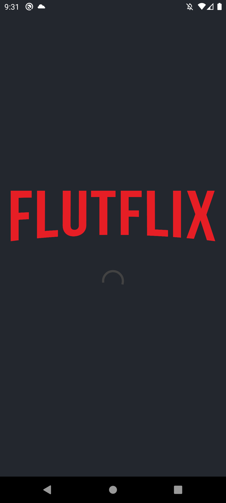
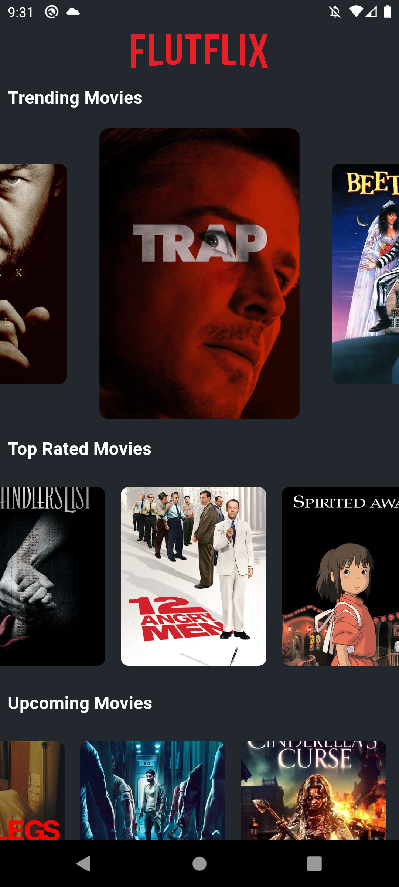
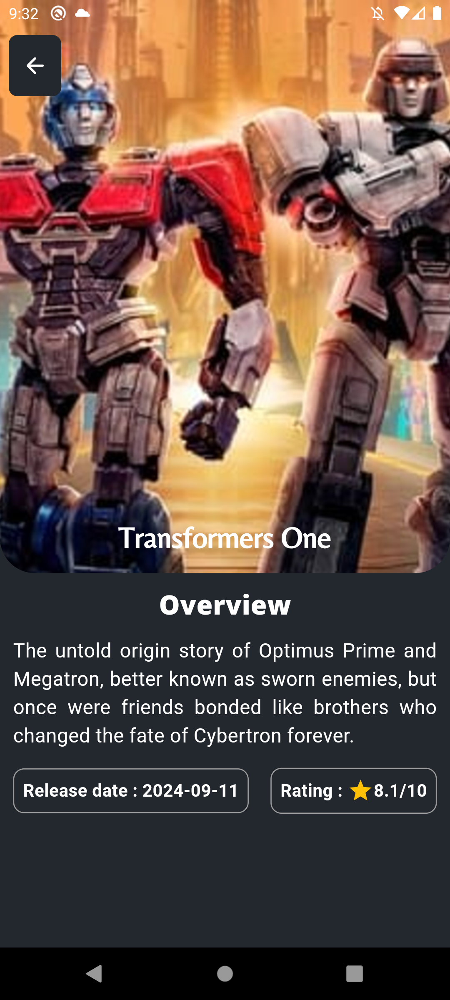

# FlutFlix

FlutFlix adalah aplikasi Flutter yang dirancang untuk memberikan pengalaman sinematik yang luar biasa dengan menyediakan informasi lengkap tentang film terbaru, populer, dan teratas. Aplikasi ini memungkinkan pengguna untuk menjelajahi film, melihat detail film, dan menikmati tampilan yang menarik.

## Fitur Utama

- **Jelajahi Film Terbaru**: Temukan film terbaru yang sedang tayang di bioskop.
- **Film Populer**: Lihat daftar film yang sedang populer di seluruh dunia.
- **Film Teratas**: Akses film dengan rating tertinggi dari berbagai kategori.
- **Detail Film**: Lihat informasi mendetail tentang setiap film, termasuk poster, deskripsi, dan lebih banyak lagi.

## Prabuka

Aplikasi ini dibangun menggunakan Flutter dan mengintegrasikan API untuk mendapatkan data film. Jika ini adalah proyek Flutter pertama Anda, Anda dapat memulai dengan [Lab: Write your first Flutter app](https://docs.flutter.dev/get-started/codelab) untuk memahami dasar-dasarnya.

## Berikut Adalah Gambarnya

1. **Splash Screen**

2. **Home Screen**

3. **Details Screen**

